## **Đề tài (Topic)**: Khuyến nghị bài hát theo cảm xúc (Recommend songs by feeling)

### **Mô tả đề tài (Description of the topic)**:
- Xây dựng mô hình web MVC bằng flask, kết nối với cơ sở dữ liệu SQL Server và kết nối với phần View bằng ngôn ngữ HTML.
- Trang web qua các giai đoạn sau khi người dùng tìm kiếm:
  + Hệ thống nhận nội dụng từ người dùng.
  + Hệ thống qua bước kiểm tra trong hệ cơ sở dữ liệu để tìm ra những bài hát có tiêu đề giống với nội dung đó.
  + **_Hệ thống trả về danh sách bài hát đã tìm được._**
  + Nếu không tìm được, câu được người dùng nhập đi qua bước chuẩn hóa tiếng Việt và loại bỏ những từ stopword.
  + Đoạn văn bản đó được chuyển thành vector và qua mô hình CNN để được dự đoán.
  + **_Hệ thống trả về danh sách bài hát theo chủ đề được dự đoán._**
- Thêm bài hát mới.
- Thay đổi tri thức cho hệ thống.

####
- Build MVC web model with flask, connect to SQL Server database and connect to View in HTML language.
- The website go through the following stages when users search:
   + The system receive content from the user.
   + The system check in the database to find songs with the same title as that content.
   + **_The system return the list of songs found._**
   + If not found, the sentence entered by the user go through the Vietnamese standardization step and remove stopwords.
   + The text converted to vector and through the CNN model to be predicted.
   + **_The system return a list of songs according to the predicted category._**
- Add new songs.
- Change knowledge for the system.

### **Cài đặt hệ thống (Install system)**:

**B1: Vào thư mục bạn muốn cài đặt và mở command prompt (Go to the folder you want to install and open the command prompt).**\
**B2: Tạo git và tải code về (Create git and download the code)**
- git init
- git pull https://github.com/Beerus-Kun/Recommend_song 

**B3: Tạo môi trường python trên thư mục (Create python environment on directory)**
- python -m venv project_env
- project_env\Scripts\activate.bat

**B4: Cài đặt thư viện (Install the libraries)**
- pip install -r requirements.txt

**B5: Tạo bảng trên SQL Server bằng [script](script.sql) (Create tables on SQL Server with [script](script.sql))**\
**B6: Thay đổi thông tin server, database, username, password trong file [connect](Model/connect.py) (Change server, database, username, password informations in [connect](Model/connect.py)) file**\
**B7: Chạy chương trình (Run the program)**
- python main.py

> **Lưu ý (Attention):** Bạn phải cài đặt python, git và python venv sẵn trong máy (You must have python, git and python venv installed on your machine)

### **Mô hình dự đoán và thực thi (Predictive modeling and training)**:

**Data**
- Chương trình chạy sẽ lấy dữ liệu từ các thư mục trong thư mục [Data](Learning/Data/), ở trong mỗi thư mục sẽ có các câu được phân theo các cảm xúc (vui, buồn, thư giãn) và được lưu vào file text. Các thư mục dữ liệu có nhiều loại như: [Full data](Learning/Data/Full_Data/) (Dữ liệu chưa loại bỏ stopwords), [Standardized data](Learning/Data/Stan_Data/) (Dữ liệu đã được chuẩn hóa dấu câu và loại bỏ stopwords), [Wrong data](Learning/Data/Wrong_Data/) (Dữ liệu đã được chuẩn hóa dấu câu, bỏ stopwords nhưng các câu bị thay đổi nhãn để tạo ra mô hình không tốt để so sánh)

####
- The running program will take data from folders in the folder [Data](Learning/Data/),there are sentences classified by emotions (happy, sad, relaxing) in each folder and saved them into text files. The data directories have many types such as: [Full data](Learning/Data/Full_Data/) (Data has not removed stopwords), [Standardized data](Learning/Data/Stan_Data/) (Data has been normalized with Vietnamese accent and stopwords are removed), [Wrong data](Learning/Data/Wrong_Data/) (Data has been normalized with Vietnamese accent, stopwords are removed and change label of sentences to compare the effectiveness of the models)

**Pre-processing**
- Đầu tiên, các câu sẽ được chuẩn hóa theo dấu câu. Ví dụ: các từ "thuý", "uỷ", "tuýên", "quỳên", "tôí" đã bị sai vị trí dấu câu nên được đổi thành "thúy", "ủy", "tuyến", "quyền", "tối". (First, sentences will be normalized according to Vietnamese accent. Example, The words "thuý", "uỷ", "tuýên", "quỳên", "tôí" have been misplaced with Vietnamese accent, so they should be changed to "thúy", "ủy", "tuyến", "quyền", "tối")

  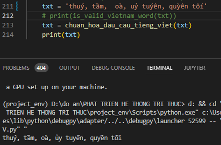

- Các câu sẽ được loại bỏ những được cho là [stopwords](Normalization/stopwords1.txt). Ví dụ: Trong câu "chạp nỗi lòng. 😘🥰 rất buồn quá làm ra bên cạnh tôi lúc này" những từ được cho là stopwords gồm: "lòng", "rất", "làm ra", "bên cạnh", "tôi", "lúc này". Câu sau khi loại bỏ stopwords còn lại là: "chạp nỗi . 😘🥰 buồn". (Sentences will be removed that are supposed to be [stopwords](Normalization/stopwords1.txt). Example: In the sentence "chạp nỗi lòng. 😘🥰 rất buồn quá làm ra bên cạnh tôi lúc này". The words that are supposed to be stopwords include: "lòng", "rất", "làm ra", "bên cạnh", "tôi", "lúc này". The sentence after removing the stopwords is "chạp nỗi . 😘🥰 buồn")

  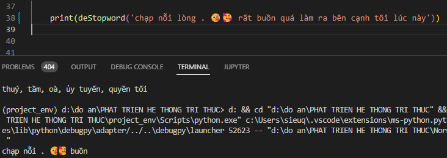

- Sử dụng Tokenizer của keras để chuyển các từ thành số theo từ điển bên dưới. (Use keras' Tokenizer to convert words to numbers according to the dictionary below.)

  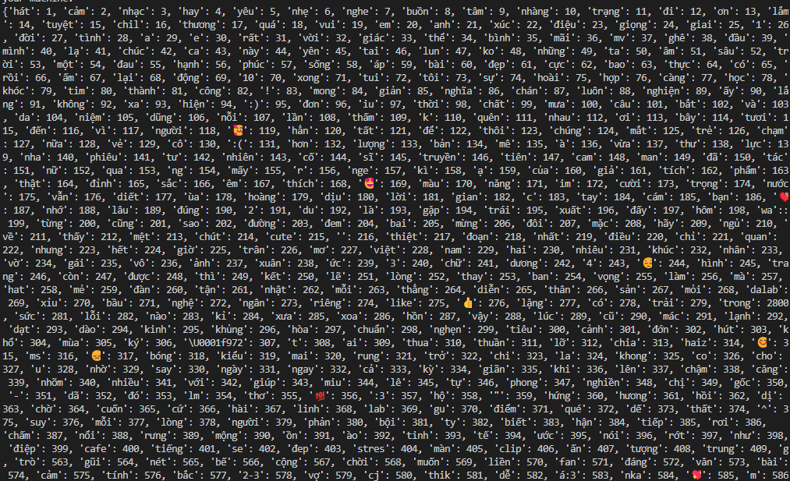

- Đồng thời sử dụng pad sequences của keras để chuyển câu "Bài hát thật sự buồn và hợp tâm trạng mình" thành một vector có độ dài là 10 ([ 60, 1, 164, 74, 8, 103, 76, 9, 11, 40]). Also use keras' pad sequences to convert the sentence "Bài hát thật sự buồn và hợp tâm trạng mình" into a vector of length 10 ([ 60, 1, 164, 74, 8, 103, 76, 9, 11, 40]).

  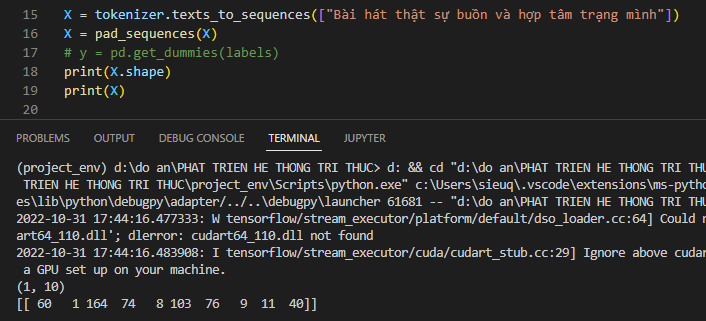

- Chuyển một câu thành một danh sách những từ (Turn a sentence into a list of words).

  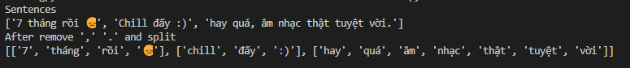

- Tạo Word Embedding bằng Word2vec (Create Word Embedding with Word2vec). 

  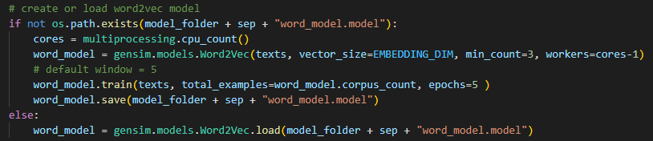

- Mỗi từ chuyển thành vector (Each word turns into a vector).

  

**Training**

- Tạo mô hình CNN để dự đoán (Create a CNN model to predict).

  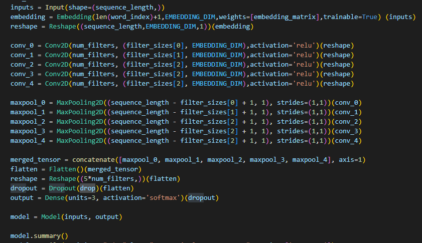

- Kết quả khi train model với tập dữ liệu chưa loại bỏ stopwords (Result when training model with dataset that has not removed stopwords).

  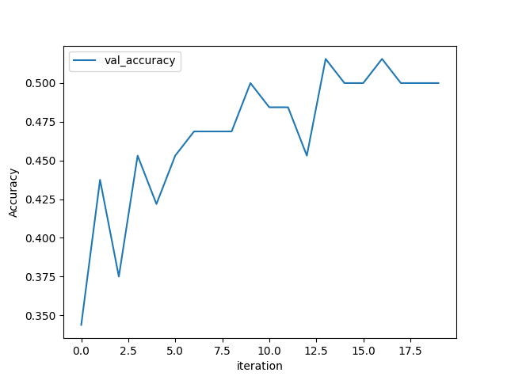

- Kết quả khi train model với tập dữ liệu đã loại bỏ stopwords (Results when training model with dataset with stopwords removed).

  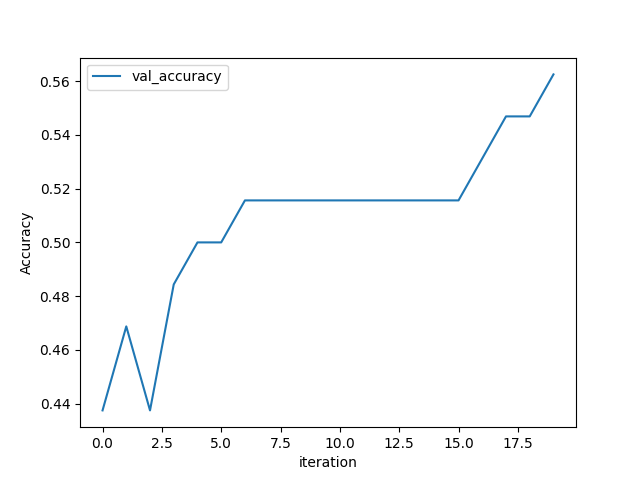

### **Demo**:
- Màn hình chính: Trên màn hình chính xuất hiện những bài hát mới nhất (Home screen: On the main screen appear the latest songs).

  

- Khi tìm kiếm từ có trong tiêu đề của bài hát, hệ thống đưa ra các bài hát đó (When searching for words in the title of the song, the system show those).

  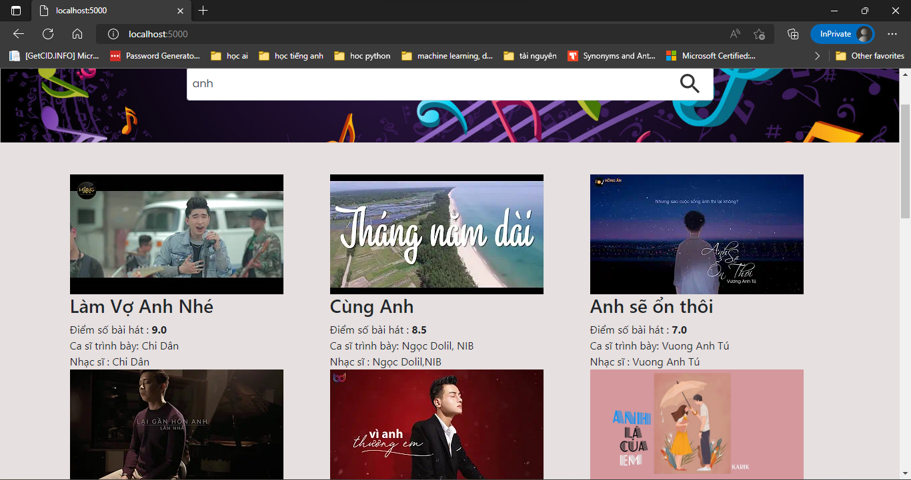

- Khi không tìm thấy tiêu đề bài hát gần giống nội dụng đang tìm kiếm, hệ thống chuyển qua dự đoán bằng tri thức (When the song title is not found similar to what you are looking for, the system switches to knowledge prediction). 

  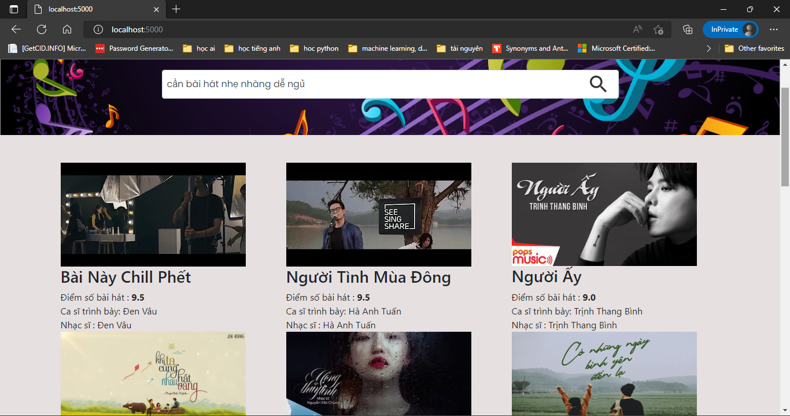

- Hệ thống cung cấp nơi thêm bài hát mới (The system provides a site to add new songs).

  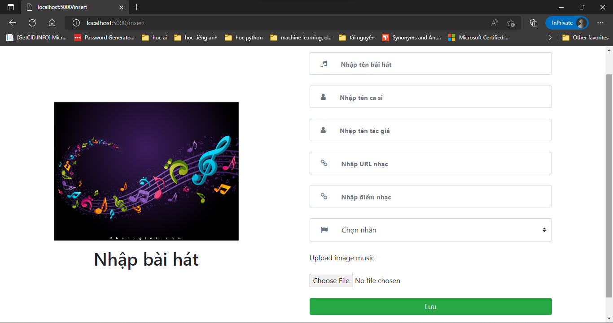

- Hệ thống cung cấp nơi đổi tri thức cho hệ thống (The system provides a place to exchange knowledge for the system).

  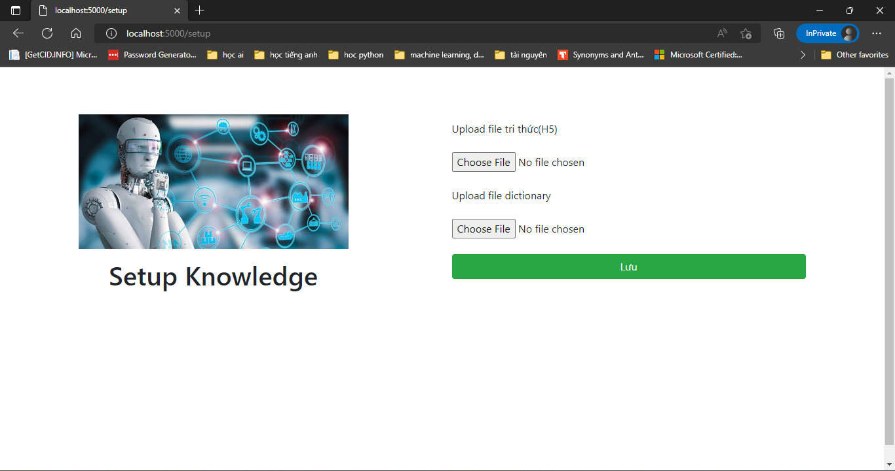

